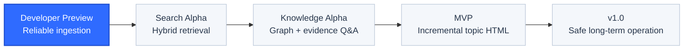
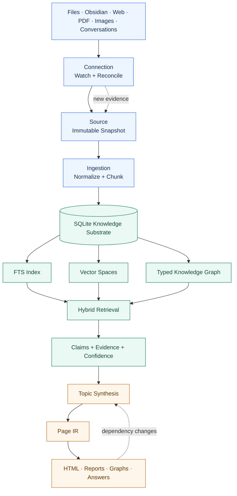
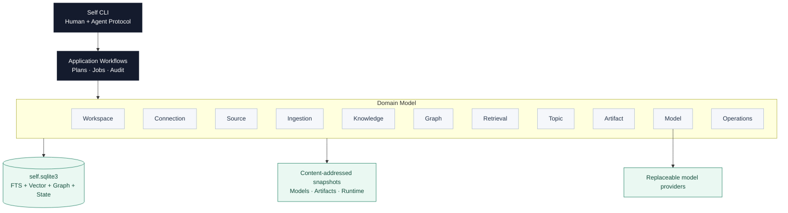

<div align="center">

# Self

### A local-first personal knowledge operating system for the age of AI agents

Self continuously turns documents, notes, projects, conversations, and research into a durable knowledge substrate that agents can search, connect, verify, and compile into trustworthy outputs.

[Vision](#the-idea) · [Principles](#design-principles) · [Architecture](#the-knowledge-loop) · [Dashboard](#project-dashboard) · [Roadmap](docs/roadmap/README.md) · [Design Docs](docs/README.md)

<br />


</div>

> [!IMPORTANT]
> Self has completed its initial product, architecture, domain, CLI, storage, testing, and performance design baseline. Implementation is beginning now. The repository describes contracts that the code must satisfy; it does not claim a production release yet.

---

## The idea

Personal knowledge is no longer a collection of pages waiting to be manually organized.

Years of notes, Obsidian vaults, project documentation, saved web pages, PDFs, conversations, images, and research fragments contain far more value than their folder structure can express. Traditional note applications ask people to remember where information lives, maintain links by hand, and repeatedly rewrite scattered material into temporary summaries.

AI changes the interface, but a chat box alone does not solve the underlying problem. Without durable evidence, stable identities, provenance, incremental indexing, and explicit relationships, an assistant can produce fluent answers while slowly losing the user's actual knowledge.

Self starts from a different premise:

> Personal knowledge should be continuously compiled into a local, evidence-backed system that both humans and agents can operate.

The source files remain intact and recoverable. Their contents are also normalized, versioned, chunked, indexed, embedded, connected, and organized into a typed knowledge graph. Reports, HTML pages, diagrams, and answers become reproducible views over that substrate rather than isolated AI outputs.

---

## What Self changes

| From | To |
| --- | --- |
| Pages and folders as the primary mental model | Stable knowledge objects, evidence, relationships, and time |
| Manual organization after every new source | Continuous ingestion, reconciliation, and incremental enrichment |
| Search as keyword matching | Hybrid retrieval across text, vectors, graph relationships, and filters |
| AI summaries with unclear grounding | Claims, citations, conflicts, confidence, and traceable evidence |
| Static reports that immediately become outdated | Versioned topics and incrementally rebuilt knowledge views |
| A single model becoming part of the data format | Replaceable providers and explicitly migrated vector spaces |
| Notes trapped inside one application | A portable, single-directory knowledge system controlled by a CLI |

---

## Project dashboard

### Current product state

| Area | Design maturity | Implementation state | Exit signal |
| --- | --- | --- | --- |
| Workspace and CLI contracts | Baseline complete | Queued | A portable Self root can be initialized and inspected |
| Source evidence and snapshots | Baseline complete | Queued | Every accepted input has an immutable local snapshot |
| Continuous connections | Detailed design complete | Queued | File changes are reconciled, archived, and recoverable |
| Ingestion and knowledge objects | Baseline complete | Queued | Every chunk traces back to a revision and source |
| FTS, vectors, and hybrid retrieval | Baseline complete | Queued | Search returns explainable evidence under latency budgets |
| Typed knowledge graph | Detailed design complete | Queued | Links, entities, relations, claims, and conflicts remain distinct |
| Evidence-grounded answers | Baseline complete | Queued | Every factual answer can be traced to retained evidence |
| Topic synthesis | Baseline complete | Queued | Cross-source reports expose consensus, conflict, and unknowns |
| Page IR and HTML artifacts | Baseline complete | Queued | Historical and incremental builds remain reproducible offline |
| Safety and operations | Baseline complete | Queued | Plan/Apply, backup, restore, migration, and crash recovery pass |

### Delivery checkpoints



The active implementation plan is tracked in [the dated roadmap](docs/roadmap/2026-07-11-initial-implementation.md). Completion is evidence-based: a milestone advances only after its CLI, data, recovery, and performance gates pass.

---

## Design principles

### 1. Knowledge is not a file format

Markdown is an excellent human-readable source and interchange format, but it is not the complete knowledge model. Self treats documents as evidence inputs and compiles them into revisions, chunks, entities, relations, claims, topics, and artifacts with stable identities.

### 2. Evidence comes before fluency

Important conclusions must be traceable:

```text
Answer / Report Section
  → Claim
  → Evidence Link
  → Chunk
  → Document Revision
  → Source Snapshot
```

When evidence is incomplete, Self should say that the answer is unknown. When sources disagree, Self should preserve the disagreement. A confident paragraph is never a substitute for provenance.

### 3. Local-first means operational control

A Self instance is a normal directory. Its database, snapshots, indexes, model registry, artifacts, logs, jobs, and recovery state stay together. The entire system can be copied, backed up, inspected, restored, and moved without reconstructing hidden cloud state.

External models are computation providers, not owners of the knowledge.

### 4. Models are replaceable; knowledge must endure

Chat models may be routed by task and changed without rewriting history. Embedding models are different: provider, model revision, dimensions, instructions, normalization, and distance define an immutable vector space.

Switching providers always creates and validates a new vector space. If the old provider disappears, Self rebuilds from locally retained chunks and temporarily degrades retrieval to FTS plus graph traversal. Equal dimensions never imply compatible vectors.

### 5. The graph must be typed and evidenced

Self does not reduce knowledge to an undifferentiated collection of `related_to` edges. It separates:

- structural relationships between sources, documents, revisions, and chunks;
- explicit document links, embeds, citations, and tags;
- typed entity relationships with controlled predicates;
- claim relationships such as support, contradiction, refinement, and replacement;
- rebuildable semantic neighbors tied to a specific vector space.

Similarity proposes candidates. Evidence establishes knowledge.

### 6. Views are compiled artifacts, not sources of truth

An answer, report, diagram, or HTML page is a versioned build over a known knowledge snapshot. Self archives its retrieval plan, evidence set, graph projection, Page IR, citations, renderer version, and final output. A new build never silently overwrites the old one.

### 7. Incremental work must converge with full rebuilds

Self reuses unchanged chunks, vectors, graph extractions, topic sections, and visual components. That optimization is valid only if the final state converges with a clean rebuild over the same inputs and versions.

### 8. Agent-first does not mean human-hostile

The CLI is a stable protocol for agents: typed commands, JSON schemas, deterministic exit codes, idempotency, plans, jobs, and audit records. The same commands remain discoverable and understandable to a person at a terminal.

---

## The knowledge loop



This loop is continuous. A changed project document becomes a new snapshot, affects only the relevant chunks and knowledge objects, marks dependent topics as stale, and produces a new artifact build without erasing prior history.

---

## One local system, multiple intelligence layers



Self begins as a modular monolith: one CLI, one optional local daemon, one SQLite database, and explicit domain ownership. It does not introduce distributed infrastructure before measured scale requires it.

---

## The experience Self is designed to create

### Start with a guided setup

```bash
self --init
```

The interactive onboarding contract checks the platform, lets the user choose a Self root and knowledge sources, configures and tests model capabilities, creates the first vector space, starts durable indexing jobs, and finishes with a redacted health dashboard. Every step can be reviewed, skipped when optional, cancelled, or resumed.

### Capture without reorganizing first

```bash
self source add ~/Documents/Obsidian --kind obsidian --watch
self source add ~/projects/example/docs --kind directory --watch
self source add https://example.com/research --kind web
```

Self archives accepted content locally, detects subsequent changes, and updates only the affected knowledge.

### Search the substrate, not a folder

```bash
self search "subagent memory isolation" --mode hybrid --explain
self graph neighbors entity:ent_123 --depth 2
self trace claim:clm_123
```

Search results expose which retrieval path found them and how they connect to retained evidence.

### Build a living topic

```bash
self topic create "Subagents" --scope "architecture, memory, isolation, collaboration"
self topic build topic:top_123 --depth deep --wait
self topic export topic:top_123 --format html
```

The resulting page is not a disposable summary. It is a versioned view containing conclusions, citations, conflicts, unknowns, timelines, comparisons, diagrams, and a local knowledge graph.

### Change knowledge safely

```bash
self entity merge entity:ent_123 entity:ent_456 --plan
self plan diff plan:plan_123
self apply plan:plan_123
```

High-impact operations expose their consequences before execution and reject stale plans after concurrent changes.

> [!NOTE]
> The commands above describe the intended stable product contract. Their implementation status is tracked by the active roadmap and capability dashboard.

---

## Trust is a product feature

Self does not compress trust into an unexplained percentage. Claims and report sections retain the dimensions that influence confidence:

| Dimension | Question |
| --- | --- |
| Source quality | Is the source authoritative, primary, and trusted for this topic? |
| Directness | Does the evidence state the claim directly or only imply it? |
| Corroboration | Do independent sources support the same conclusion? |
| Freshness | Is the evidence recent enough for the question? |
| Extraction quality | Did parsing, OCR, entity resolution, or model extraction introduce uncertainty? |
| Consistency | Is there unresolved counter-evidence? |
| User verification | Has the user confirmed, corrected, or rejected the claim? |

Reports can therefore distinguish consensus, single-source statements, user beliefs, AI inferences, disputed claims, and genuine unknowns.

---

## Performance philosophy

Self separates interactive latency from background intelligence:

| Interaction | Product expectation |
| --- | --- |
| CLI control and point lookups | Millisecond-scale |
| FTS, vector, graph, and hybrid local retrieval | Millisecond to sub-second |
| Existing Page IR to HTML | Millisecond to sub-second |
| Model calls, first-time embedding, OCR, and deep synthesis | Durable background jobs |
| Full index, graph, or vector-space rebuilds | Shadow builds while the previous version remains available |

Slow computation is acceptable. A frozen interface, unavailable old report, or silently incomplete result is not.

---

## What Self is not

- It is not another Markdown editor.
- It is not a chat wrapper around an Obsidian vault.
- It is not a hosted service that requires surrendering the source corpus.
- It is not a graph made of arbitrary model-generated edges.
- It is not a vector database that discards provenance.
- It is not an autonomous system allowed to rewrite personal knowledge without plans, versions, and audit.
- It is not committed to one model vendor, embedding model, or rendering template.

---

## Why a CLI

The CLI is the narrow waist of Self.

It gives agents a composable, typed, inspectable interface without making a graphical application the source of business rules. A future Obsidian plugin, local web interface, MCP server, or HTTP API can call the same application workflows and preserve the same evidence, safety, and audit semantics.

For people, it remains scriptable, portable, and close to the projects where knowledge is created. For agents, it becomes a stable operating protocol rather than an informal prompt convention.

---

## The long-term value

Self is intended to become a durable layer between a person's information and every AI system they choose to use.

Models will improve. Providers will disappear. File formats will change. Projects will be renamed. Reports will be regenerated. The valuable asset is the continuity underneath: retained sources, stable identities, explicit relationships, user corrections, historical claims, and reproducible knowledge views.

The goal is not merely to remember more.

The goal is to make a lifetime of knowledge inspectable, connected, trustworthy, and usable by both the person who owns it and the agents working on their behalf.

---

## Follow the implementation

| Resource | Purpose |
| --- | --- |
| [Active roadmap](docs/roadmap/2026-07-11-initial-implementation.md) | Ordered implementation steps, stage gates, and required evidence |
| [Architecture](docs/architecture.md) | Product boundary, object model, workflows, and CLI contract |
| [Design conventions](docs/design-conventions.md) | Canonical terminology, ownership, states, IDs, and paths |
| [Model selection](docs/model-selection.md) | Model routing, Qwen availability, vector spaces, migration, and recovery |
| [Distribution and onboarding](docs/distribution.md) | npm packages, clean-machine installation, interactive setup, upgrades, and supply-chain safety |
| [Knowledge graph](docs/domains/graph/README.md) | Typed relationships, evidence, SQLite schema, rebuilds, and graph CLI |
| [Performance](docs/performance.md) | Interactive budgets, background work, and release gates |
| [Testing](docs/testing.md) | Real CLI, single-root, crash, recovery, and release testing |

<div align="center">

**Local knowledge. Durable evidence. Replaceable intelligence.**

</div>
